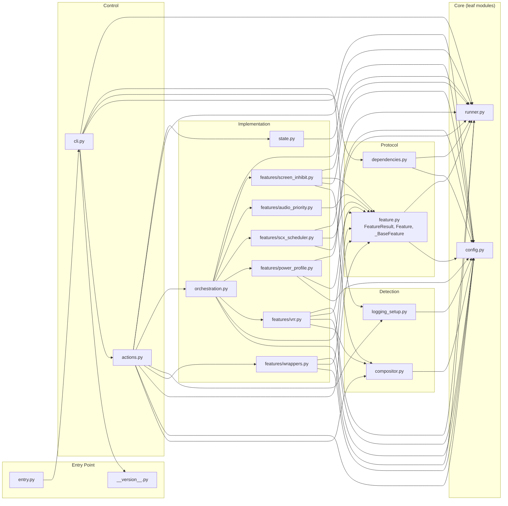
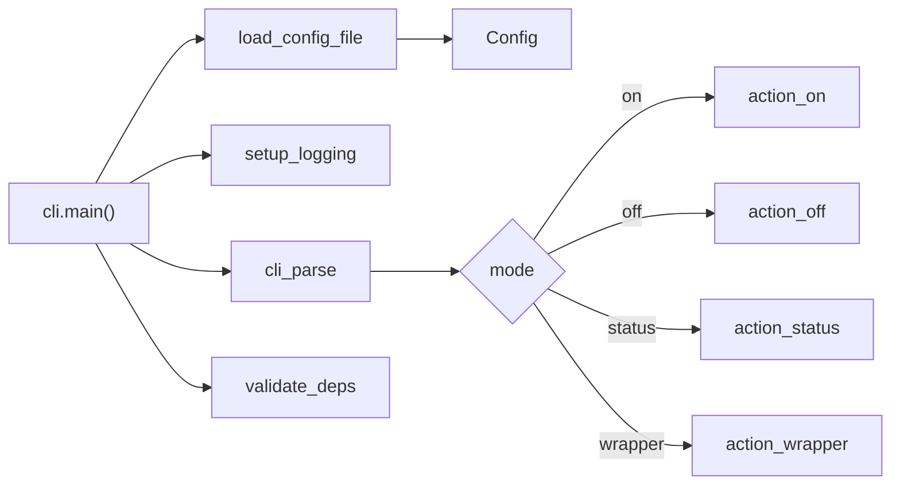
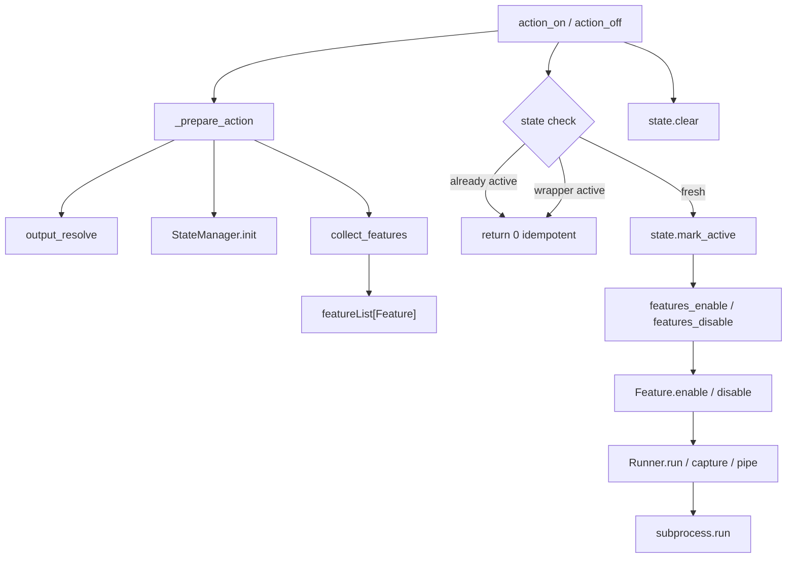
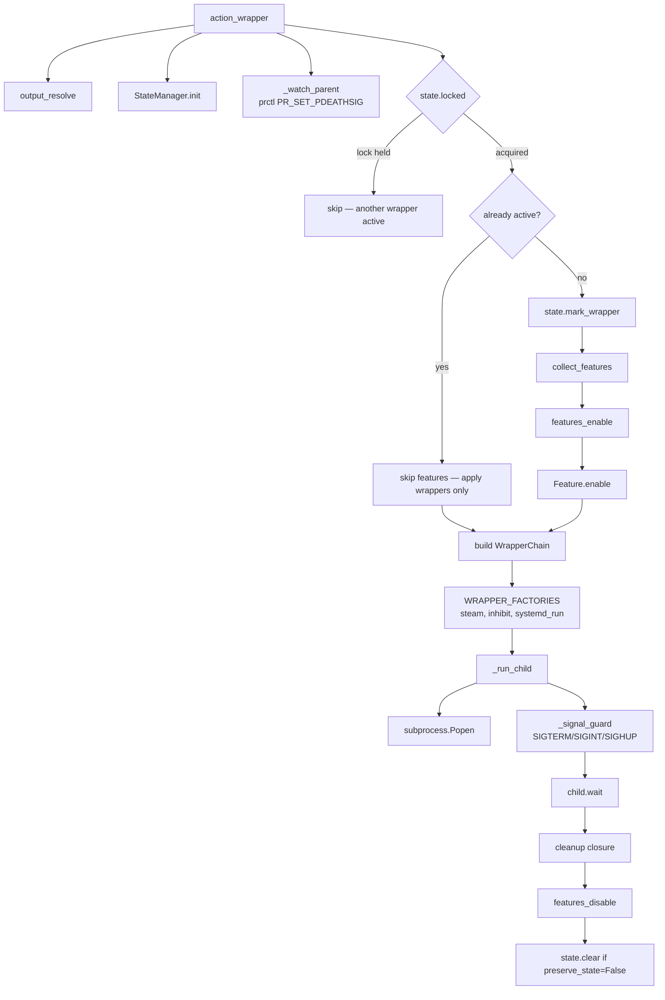
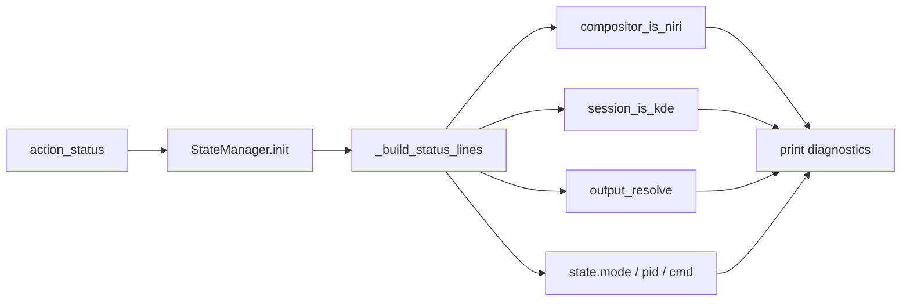
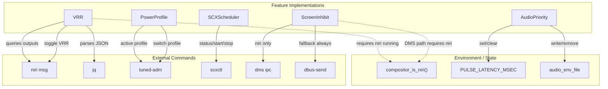

# Design Document

## Architecture Overview

Gamemode is a gaming performance toggle tool for Linux desktops, targeting the **niri** compositor and **KDE** sessions. It provides two modes of operation:

1. **Toggle mode** (`on`/`off`/`status`): Immediately enables or disables a set of system features
2. **Wrapper mode** (`-- <command>` or bare command): Spawns a child process with feature wrappers pre-pended, with auto-cleanup via signal guards and parent-death detection

## Module Dependency Graph

All edges represent direct `import`/`from ... import` relationships.

## Module Map

### Entry Point

| Module           | Purpose                                                              |
| ---------------- | -------------------------------------------------------------------- |
| `entry.py`       | Imports and calls `main()` from `cli.py`                             |
| `__version__.py` | Provides `__version__` and `_get_version()` via `importlib.metadata` |

### CLI Layer

| Module   | Purpose                                                                      |
| -------- | ---------------------------------------------------------------------------- |
| `cli.py` | Parses `on`/`off`/`status`/`wrapper` commands; dispatches to action handlers |

### Actions

| Module       | Purpose                                                                                                                                                     |
| ------------ | ----------------------------------------------------------------------------------------------------------------------------------------------------------- |
| `actions.py` | Implements `on` (activate features), `off` (deactivate + clear state), `status` (diagnostic output), `wrapper` (launch child with wrappers + signal guards) |

### Configuration

| Module      | Purpose                                                                                                                                                                                     |
| ----------- | ------------------------------------------------------------------------------------------------------------------------------------------------------------------------------------------- |
| `config.py` | Loads `~/.config/gamemode.conf` (KEY=VALUE), provides frozen `Config` dataclass reading from env vars. Controls which features are enabled via `toggle_features` / `wrapper_features` sets. |

### State Management

| Module     | Purpose                                                                                                                                                  |
| ---------- | -------------------------------------------------------------------------------------------------------------------------------------------------------- |
| `state.py` | `StateManager` — persists mode (active/wrapper), PID, and command to JSON file. Uses `fcntl.flock` for mutual exclusion (prevents concurrent instances). |

### Compositor Detection

| Module          | Purpose                                                                                                                              |
| --------------- | ------------------------------------------------------------------------------------------------------------------------------------ |
| `compositor.py` | Detects **niri** via `XDG_SESSION_DESKTOP` or `pgrep -x niri`. Checks for **KDE** via env vars. Resolves target display output name. |

### Dependency Validation

| Module            | Purpose                                                                                                                                                          |
| ----------------- | ---------------------------------------------------------------------------------------------------------------------------------------------------------------- |
| `dependencies.py` | `validate_deps()` — checks for required commands (`tuned-adm`, `systemd-inhibit`, `dbus-send`, `scxctl`, `jq`) only when their corresponding feature is enabled. |

### Feature Protocol

| Module       | Purpose                                                                                                                                                                                                                                                                                              |
| ------------ | ---------------------------------------------------------------------------------------------------------------------------------------------------------------------------------------------------------------------------------------------------------------------------------------------------- |
| `feature.py` | Defines `Feature` protocol, `CommandWrapper` and `WrapperFactory` type aliases. Provides `_BaseFeature` with gating (`_gate`), guarded execution (`_guarded`), result logging (`_log_result`), and `make_checked_cmd` helper for creating `CheckedCommandRunner` instances bound to the base runner. |

### Feature Implementations (Package)

| Module                       | Purpose                                                                                                                                                                                                                                                                                                                              |
| ---------------------------- | ------------------------------------------------------------------------------------------------------------------------------------------------------------------------------------------------------------------------------------------------------------------------------------------------------------------------------------ |
| `features/vrr.py`            | **VRR** — niri VRR toggle via `niri msg`; queries display capability via `jq`, toggles via `niri msg` IPC                                                                                                                                                                                                                            |
| `features/power_profile.py`  | **PowerProfile** — switches tuned profile via `tuned-adm`; reads current profile via `tuned-adm active`, sets profile via `tuned-adm profile`                                                                                                                                                                                        |
| `features/scx_scheduler.py`  | **SCXScheduler** — starts/stops SCX scheduler via `scxctl`; reads status via `scxctl status`, applies scheduler via `scxctl set-scheduler`                                                                                                                                                                                           |
| `features/audio_priority.py` | **AudioPriority** — sets `PULSE_LATENCY_MSEC` for PulseAudio low-latency mode; writes to env file and clears on disable                                                                                                                                                                                                              |
| `features/screen_inhibit.py` | **ScreenInhibit** — prevents screen lock via DMS (niri) or DBus (screensaver); checks display manager type via `compositor.py`. Includes evdev-based KB&M idle monitor (`_IdleMonitorThread`) that fires external commands on idle/active transitions independently of DMS.                                                          |
| `features/wrappers.py`       | **Wrapper factories**: `steam_wrapper_factory` (prepends Steam env script), `inhibit_wrapper_factory` (adds `systemd-inhibit`), `systemd_run_wrapper_factory` (prepends `systemd-run`). **`WrapperChain`** — chains command wrappers sequentially. **`SystemdRun`** — prepends `systemd-run` to command argv (not a toggle feature). |

### Orchestration

| Module             | Purpose                                                                                                                                                        |
| ------------------ | -------------------------------------------------------------------------------------------------------------------------------------------------------------- |
| `orchestration.py` | `collect_features()` — instantiates enabled features from config. `features_enable()`/`features_disable()` — iterate features and call `enable()`/`disable()`. |

### Runner Abstraction

| Module      | Purpose                                                                                                                                                                                                                                                                |
| ----------- | ---------------------------------------------------------------------------------------------------------------------------------------------------------------------------------------------------------------------------------------------------------------------- |
| `runner.py` | `Runner` — wraps `subprocess.run` with logging. Supports `run()`, `capture()`, `pipe()`, `require()`, and `make_checked_runner()`. `CheckedCommandRunner` — pre-validates command availability before execution; provides `run_or_none()`, `run_ok()`, `is_available`. |

### Logging

| Module             | Purpose                                                                               |
| ------------------ | ------------------------------------------------------------------------------------- |
| `logging_setup.py` | Configures `gamemode` logger with console (stderr) handler and optional file handler. |

## Data Flow

### Shared Entry

### Toggle Mode (on / off)

### Wrapper Mode

### Status Mode

## Feature Interdependencies

Features depend on external commands, compositor state, and environment variables. Missing dependencies are handled gracefully (skip/noop) rather than failing.

### Feature Execution Rules

| Feature       | Gate             | Compositor requirement | External deps          | Fallback behavior                                                                                  |
| ------------- | ---------------- | ---------------------- | ---------------------- | -------------------------------------------------------------------------------------------------- |
| VRR           | `enable_vrr`     | niri only              | `niri`, `jq`           | Skip if not niri or not capable                                                                    |
| PowerProfile  | `enable_tuned`   | None                   | `tuned-adm`            | Noop if already on correct profile                                                                 |
| SCXScheduler  | `enable_scx`     | None                   | `scxctl`               | Noop if already loaded                                                                             |
| AudioPriority | `enable_audio`   | None                   | None (env + file only) | Always succeeds                                                                                    |
| ScreenInhibit | `enable_inhibit` | niri for DMS path      | `dms`, `dbus-send`     | Falls back to ScreenSaver if DMS fails; optional evdev idle monitor gated by `enable_idle_monitor` |

## Features

| Feature       | Toggle | Wrapper | Description                                                                          |
| ------------- | ------ | ------- | ------------------------------------------------------------------------------------ |
| `vrr`         | ✓      |         | Toggles VRR on a specific display output via niri IPC                                |
| `scx`         | ✓      |         | Starts/stops the SCX scheduler (default: `lavd` in `gaming` mode)                    |
| `tuned`       | ✓      |         | Switches system power profile via tuned daemon                                       |
| `audio`       | ✓      |         | Sets `PULSE_LATENCY_MSEC` for PulseAudio low-latency mode                            |
| `inhibit`     | ✓      | ✓       | Prevents screen blanking/lock via DMS (niri) or DBus; wrapper adds `systemd-inhibit` |
| `steam`       |        | ✓       | Pre-pends Steam environment script to command                                        |
| `systemd_run` |        | ✓       | Wraps command with `systemd-run` for resource control (CPU/IO weight)                |

## External Dependencies (Standard Library Only)

All dependencies are Python stdlib: `ctypes`, `dataclasses`, `fcntl`, `functools`, `importlib.metadata`, `json`, `logging`, `os`, `pathlib`, `select`, `shutil`, `signal`, `struct`, `subprocess`, `sys`, `textwrap`, `threading`, `time`, `typing`, `contextlib`.

No third-party packages required.

## Build System

The project uses a Makefile to produce a **deterministic, reproducible** Python zipapp (`.pyz`). Key build features:

- Fixed `SOURCE_DATE_EPOCH` (Jan 1, 1980) for reproducible timestamps
- `LC_ALL=C sort` for deterministic file ordering in the archive
- Stripped extra file attributes (`-X`)
- Version injected via `sed` into `__version__.py`
- SHA256 checksum generated for verification
