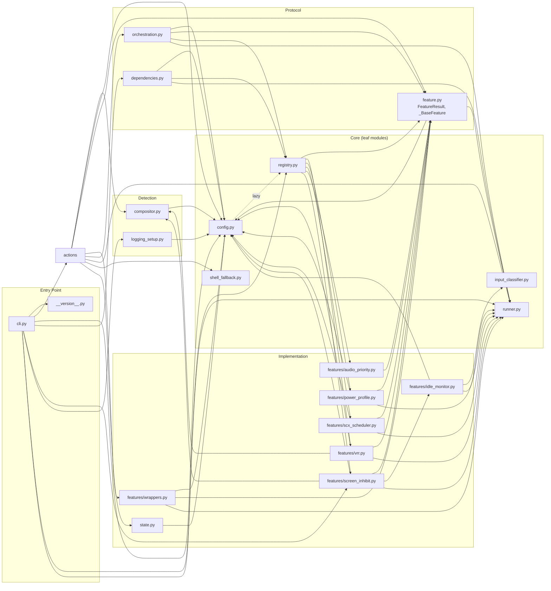
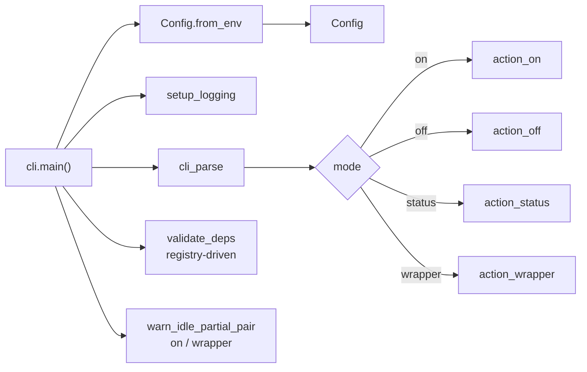
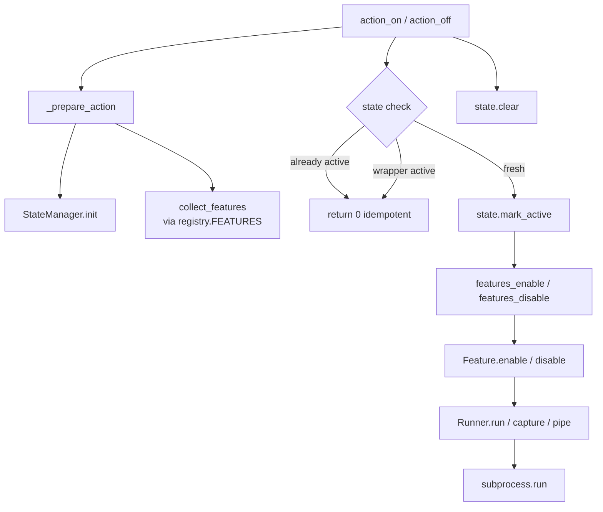
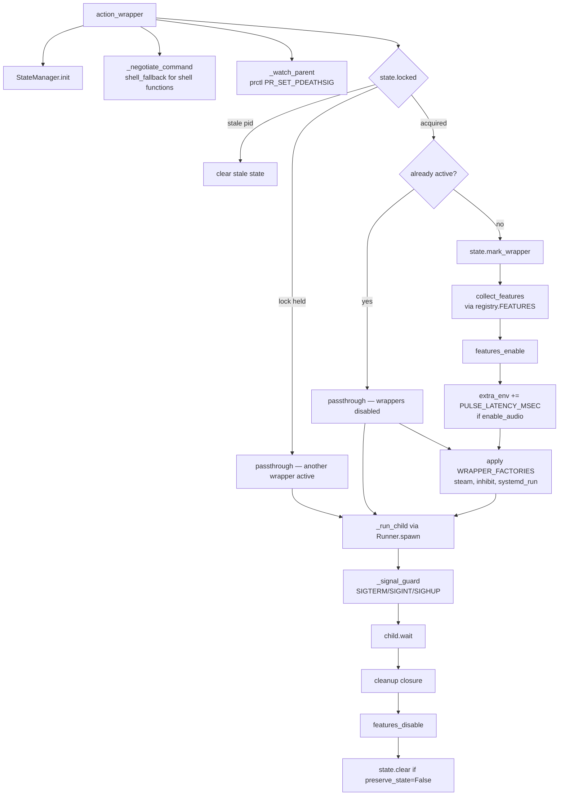
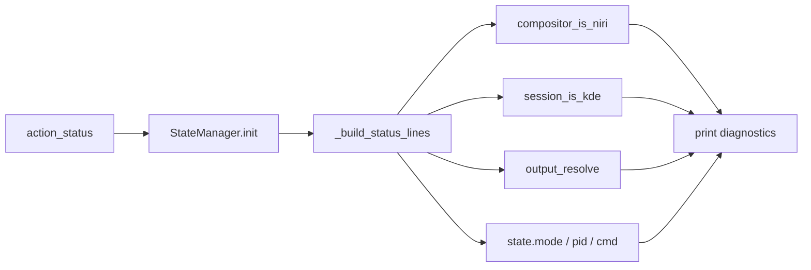
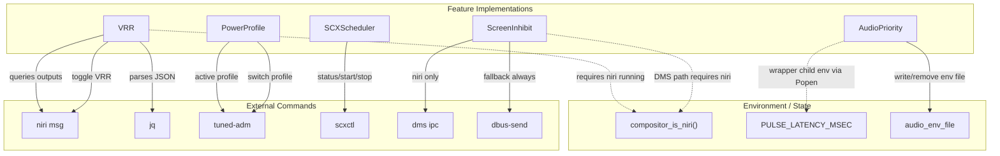

# Design Document

## Architecture Overview

Gamemode is a gaming performance toggle tool for Linux desktops, targeting the **niri** compositor and **KDE** sessions. It provides two modes of operation:

1. **Toggle mode** (`on`/`off`/`status`): Immediately enables or disables a set of system features
2. **Wrapper mode** (`-- <command>` or bare command): Spawns a child process with feature wrappers pre-pended, with auto-cleanup via signal guards and parent-death detection

## Module Dependency Graph

All edges represent direct `import` / `from ... import` relationships. The `config → registry` edge is a **lazy import** (inside `_default_toggle()`) that breaks the `config → registry → features → config` cycle.

```mermaid
graph LR
    subgraph entry["Entry Point"]
        version[__version__.py]
        cli[cli.py]
    end

    subgraph core["Core (leaf modules)"]
        config[config.py]
        runner[runner.py]
        registry[registry.py]
        shell_fallback[shell_fallback.py]
        input_classifier[input_classifier.py]
    end

    subgraph detection["Detection"]
        compositor[compositor.py]
        logging_setup[logging_setup.py]
    end

    subgraph protocol["Protocol"]
        feature[feature.py<br/>FeatureResult, _BaseFeature]
        dependencies[dependencies.py]
        orchestration[orchestration.py]
    end

    subgraph implementation["Implementation"]
        features_vrr[features/vrr.py]
        features_pp[features/power_profile.py]
        features_scx[features/scx_scheduler.py]
        features_audio[features/audio_priority.py]
        features_inhibit[features/screen_inhibit.py]
        features_idle[features/idle_monitor.py]
        features_wrappers[features/wrappers.py]
        state[state.py]
    end

    cli --> version
    cli --> actions
    cli --> config
    cli --> dependencies
    cli --> features_inhibit
    cli --> logging_setup
    cli --> registry
    cli --> runner

    actions --> compositor
    actions --> config
    actions --> feature
    actions --> features_wrappers
    actions --> orchestration
    actions --> runner
    actions --> shell_fallback
    actions --> state

    compositor --> config
    config -. lazy .-> registry
    dependencies --> config
    dependencies --> registry
    dependencies --> runner
    feature --> config
    feature --> runner
    features_vrr --> compositor
    features_vrr --> config
    features_vrr --> feature
    features_vrr --> runner
    features_pp --> config
    features_pp --> feature
    features_pp --> runner
    features_scx --> config
    features_scx --> feature
    features_scx --> runner
    features_audio --> feature
    features_inhibit --> compositor
    features_inhibit --> config
    features_inhibit --> feature
    features_inhibit --> features_idle
    features_inhibit --> runner
    features_idle --> config
    features_idle --> input_classifier
    features_idle --> runner
    features_wrappers --> config
    features_wrappers --> feature
    features_wrappers --> runner
    logging_setup --> config
    orchestration --> config
    orchestration --> feature
    orchestration --> registry
    orchestration --> runner
    registry --> feature
    registry --> features_vrr
    registry --> features_pp
    registry --> features_scx
    registry --> features_audio
    registry --> features_inhibit
    state --> config
```

## Module Map

### Entry Point

| Module           | Purpose                                                              |
| ---------------- | -------------------------------------------------------------------- |
| `cli.py`         | Entry point: `main()` parses the CLI and dispatches to the actions   |
| `__version__.py` | Provides `__version__` and `_get_version()` via `importlib.metadata` |

The zipapp build synthesizes `__main__.py` (`from entry import main`) in the build staging area only — there is no `entry.py` in the source tree.

### CLI Layer

| Module   | Purpose                                                                                                                                                                      |
| -------- | ---------------------------------------------------------------------------------------------------------------------------------------------------------------------------- |
| `cli.py` | `cli_parse()` — `on`/`off`/`status`/`wrapper` modes; `main()` — config, logging, `validate_deps`, dispatch. USAGE text is templated from `registry.default_toggle_string()`. |

### Actions

| Module       | Purpose                                                                                                                                                                                                                                                                                                                                                                                                                                                |
| ------------ | ------------------------------------------------------------------------------------------------------------------------------------------------------------------------------------------------------------------------------------------------------------------------------------------------------------------------------------------------------------------------------------------------------------------------------------------------------ |
| `actions.py` | `action_on` / `action_off` / `action_status` / `action_wrapper`. `_negotiate_command` (shell-function fallback via `shell_fallback`), `_watch_parent` (`prctl PR_SET_PDEATHSIG`), `_signal_guard` (SIGTERM/SIGINT/SIGHUP), `_run_child` (sole child spawn, via `Runner.spawn`), `_build_cleanup_closure`. In wrapper mode with `enable_audio`, `PULSE_LATENCY_MSEC` is routed to the child through the same `extra_env` channel as the shell fallback. |

### Configuration

| Module      | Purpose                                                                                                                                                                                                                                                                                                             |
| ----------- | ------------------------------------------------------------------------------------------------------------------------------------------------------------------------------------------------------------------------------------------------------------------------------------------------------------------- |
| `config.py` | `Config.from_env()` — the **single env boundary**: `~/.config/gamemode.conf` (KEY=VALUE) overridden by `os.environ`, one read, one typed `Config` dataclass. Feature routing via `toggle_features` / `wrapper_features` sets; derived paths (`state_dir`, `state_file`, `lock_file`, `log_file`, `audio_env_file`). |

### Feature Registry

| Module        | Purpose                                                                                                                                                                                                                                                                                                                                                                                                   |
| ------------- | --------------------------------------------------------------------------------------------------------------------------------------------------------------------------------------------------------------------------------------------------------------------------------------------------------------------------------------------------------------------------------------------------------- |
| `registry.py` | `FEATURES: dict[str, FeatureSpec]` — the **single declaration of the feature set**: factory class, `(command, config-flag)` deps, and default-toggle membership per feature. Drives `collect_features`, `validate_deps`, the default `TOGGLE_FEATURES` string, and the USAGE routing text. Adding a feature is one line here. `steam` is registered with `factory=None` (wrapper-only, no feature class). |

### State Management

| Module     | Purpose                                                                                                                                                  |
| ---------- | -------------------------------------------------------------------------------------------------------------------------------------------------------- |
| `state.py` | `StateManager` — persists mode (active/wrapper), PID, and command to JSON file. Uses `fcntl.flock` for mutual exclusion (prevents concurrent instances). |

### Compositor Detection

| Module          | Purpose                                                                                                                                                                                                                                 |
| --------------- | --------------------------------------------------------------------------------------------------------------------------------------------------------------------------------------------------------------------------------------- |
| `compositor.py` | Detects **niri** via `XDG_SESSION_DESKTOP`/`XDG_CURRENT_DESKTOP` or a one-shot `pgrep -x niri` probe (documented exec exception — diagnostic, not feature logic). Checks for **KDE** via env vars. Resolves target display output name. |

### Dependency Validation

| Module            | Purpose                                                                                                                                                                 |
| ----------------- | ----------------------------------------------------------------------------------------------------------------------------------------------------------------------- |
| `dependencies.py` | `validate_deps()` — checks the `(command, config-flag)` pairs declared in `registry.FEATURES` only when their feature flag is enabled. No hardcoded command→flag table. |

### Feature Protocol

| Module       | Purpose                                                                                                                                                                                                                                                            |
| ------------ | ------------------------------------------------------------------------------------------------------------------------------------------------------------------------------------------------------------------------------------------------------------------ |
| `feature.py` | Defines `FeatureResult`, `CommandWrapper` and `WrapperFactory` type aliases. Provides `_BaseFeature` with gated `enable()`/`disable()` (config check in one place; `_do_enable`/`_do_disable` are the hooks), plus the `log_feature_result` module-level function. |

### Feature Implementations (Package)

| Module                       | Purpose                                                                                                                                                                                                                                                                                                                        |
| ---------------------------- | ------------------------------------------------------------------------------------------------------------------------------------------------------------------------------------------------------------------------------------------------------------------------------------------------------------------------------ |
| `features/vrr.py`            | **VRR** — niri VRR toggle via `niri msg`; queries display capability via `jq`, toggles via `niri msg` IPC                                                                                                                                                                                                                      |
| `features/power_profile.py`  | **PowerProfile** — switches tuned profile via `tuned-adm`; reads current profile via `tuned-adm active`, sets profile via `tuned-adm profile`                                                                                                                                                                                  |
| `features/scx_scheduler.py`  | **SCXScheduler** — starts/stops SCX scheduler via `scxctl`; reads status via `scxctl status`, applies scheduler via `scxctl set-scheduler`                                                                                                                                                                                     |
| `features/audio_priority.py` | **AudioPriority** — writes the `audio.env` file (`export PULSE_LATENCY_MSEC=...`); the env file is the contract, `os.environ` is never mutated. The wrapper child receives the override through the Popen env channel in `actions.py`.                                                                                         |
| `features/screen_inhibit.py` | **ScreenInhibit** — prevents screen lock via DMS (niri) or DBus (screensaver). Starts/stops the KB&M idle monitor thread and emits the `warn_idle_partial_pair` warning (also called from `cli.py` before `on`/`wrapper`).                                                                                                     |
| `features/idle_monitor.py`   | **`_IdleMonitorThread`** — evdev-based KB&M idle monitor: polls `/dev/input/event*` via `select()`, fires `IDLE_CMD`/`ACTIVE_CMD` on idle/active transitions, timeout from DMS settings. Device classification delegated to `input_classifier`.                                                                                |
| `features/wrappers.py`       | **Wrapper factories**: `steam_wrapper_factory` (prepends Steam env script), `inhibit_wrapper_factory` (adds `systemd-inhibit --what=idle:sleep`; gated by `ENABLE_SLEEP_INHIBIT`), `systemd_run_wrapper_factory` (prepends `systemd-run`). `WRAPPER_FACTORIES` dict — `action_wrapper` applies the enabled factories in order. |

### Input Classification

| Module                | Purpose                                                                                                                                                                                                               |
| --------------------- | --------------------------------------------------------------------------------------------------------------------------------------------------------------------------------------------------------------------- |
| `input_classifier.py` | `classify_input(event_path)` — pure module: udevadm / sysfs heuristics classifying an evdev device as `"kbm"` or `None` (steam controllers always excluded). Testable against a fake sysfs tree with no real devices. |

### Orchestration

| Module             | Purpose                                                                                                                                                                                                                                   |
| ------------------ | ----------------------------------------------------------------------------------------------------------------------------------------------------------------------------------------------------------------------------------------- |
| `orchestration.py` | `collect_features()` — instantiates enabled features from `registry.FEATURES` (no inline feature construction). `features_enable()`/`features_disable()` — iterate features and call `enable()`/`disable()` through `log_feature_result`. |

### Runner Abstraction

| Module      | Purpose                                                                                                                                                                                                                                                                                                                                                                                         |
| ----------- | ----------------------------------------------------------------------------------------------------------------------------------------------------------------------------------------------------------------------------------------------------------------------------------------------------------------------------------------------------------------------------------------------- |
| `runner.py` | `Runner` — wraps `subprocess` for all host-executable calls: `resolve()`, `require()`, `run()`, `capture()`, `pipe()`, `make_checked_runner()`, and `spawn()` — the **sole exec boundary** for children: debug logging and env merge (`{**os.environ, **env}`) in one place. `CheckedCommandRunner` — pre-validates command availability; provides `run_or_none()`, `run_ok()`, `is_available`. |

### Shell Fallback

| Module              | Purpose                                                                                                                                                                                                                                                                                                  |
| ------------------- | -------------------------------------------------------------------------------------------------------------------------------------------------------------------------------------------------------------------------------------------------------------------------------------------------------- |
| `shell_fallback.py` | `shell_fallback(command, env=None)` — pure negotiation of shell-function resolution: returns `(argv, extra_env)` for `bash` (sources `$BASH_ENV` → `~/.bashrc`), `zsh` (sources `.zshenv`), `fish` (auto-loads config); `sh` has no mechanism → `None`. Verified by `tests/smoketest_shell_function.py`. |

### Logging

| Module             | Purpose                                                                               |
| ------------------ | ------------------------------------------------------------------------------------- |
| `logging_setup.py` | Configures `gamemode` logger with console (stderr) handler and optional file handler. |

## Data Flow

### Shared Entry

```mermaid
graph LR
    A["cli.main()"] --> B[Config.from_env]
    B --> C[Config]
    A --> D[setup_logging]
    A --> E[cli_parse]
    E --> F{mode}
    F -->|on| G[action_on]
    F -->|off| H[action_off]
    F -->|status| I[action_status]
    F -->|wrapper| J[action_wrapper]
    A --> K[validate_deps<br/>registry-driven]
    A --> L[warn_idle_partial_pair<br/>on / wrapper]
```

### Toggle Mode (on / off)

```mermaid
graph TD
    A[action_on / action_off] --> B[_prepare_action]
    B --> C["StateManager.init"]
    B --> D[collect_features<br/>via registry.FEATURES]
    A --> G{state check}
    G -->|already active| H[return 0 idempotent]
    G -->|wrapper active| H
    G -->|fresh| I["state.mark_active"]
    I --> J[features_enable / features_disable]
    J --> K["Feature.enable / disable"]
    K --> L["Runner.run / capture / pipe"]
    L --> M["subprocess.run"]
    A --> N["state.clear"]
```

### Wrapper Mode

```mermaid
graph TD
    A[action_wrapper] --> B["StateManager.init"]
    A --> C[_negotiate_command<br/>shell_fallback for shell functions]
    A --> D[_watch_parent<br/>prctl PR_SET_PDEATHSIG]
    A --> E{"state.locked"}
    E -->|lock held| F[passthrough — another wrapper active]
    E -->|stale pid| G[clear stale state]
    E -->|acquired| H{already active?}
    H -->|yes| I[passthrough — wrappers disabled]
    H -->|no| J["state.mark_wrapper"]
    J --> K[collect_features<br/>via registry.FEATURES]
    K --> L[features_enable]
    L --> M[extra_env += PULSE_LATENCY_MSEC<br/>if enable_audio]
    I --> N[apply WRAPPER_FACTORIES<br/>steam, inhibit, systemd_run]
    M --> N
    F --> O[_run_child via Runner.spawn]
    I --> O
    N --> O
    O --> P["_signal_guard<br/>SIGTERM/SIGINT/SIGHUP"]
    P --> Q["child.wait"]
    Q --> R[cleanup closure]
    R --> S[features_disable]
    S --> T["state.clear if preserve_state=False"]
```

### Status Mode

```mermaid
graph LR
    A[action_status] --> B["StateManager.init"]
    B --> C[_build_status_lines]
    C --> D[compositor_is_niri]
    C --> E[session_is_kde]
    C --> F[output_resolve]
    C --> G["state.mode / pid / cmd"]
    D --> H[print diagnostics]
    E --> H
    F --> H
    G --> H
```

## Feature Interdependencies

Features depend on external commands, compositor state, and environment variables. Missing dependencies are handled gracefully (skip/noop) rather than failing.

```mermaid
graph TD
    subgraph features["Feature Implementations"]
        vrr["VRR"]
        pp["PowerProfile"]
        scx["SCXScheduler"]
        audio["AudioPriority"]
        inhibit["ScreenInhibit"]
    end

    subgraph external["External Commands"]
        niri["niri msg"]
        jq["jq"]
        tuned["tuned-adm"]
        scxctl["scxctl"]
        dms["dms ipc"]
        dbus["dbus-send"]
    end

    subgraph env["Environment / State"]
        niri_detect["compositor_is_niri()"]
        pulse["PULSE_LATENCY_MSEC"]
        audio_file["audio_env_file"]
    end

    vrr -->|queries outputs| niri
    vrr -->|parses JSON| jq
    vrr -->|toggle VRR| niri
    vrr -.->|requires niri running| niri_detect

    pp -->|active profile| tuned
    pp -->|switch profile| tuned

    scx -->|status/start/stop| scxctl

    audio -->|write/remove env file| audio_file
    audio -.->|wrapper child env via Popen| pulse

    inhibit -->|niri only| dms
    inhibit -->|fallback always| dbus
    inhibit -.->|DMS path requires niri| niri_detect
```

### Feature Execution Rules

| Feature       | Gate             | Compositor requirement | External deps (registry)                      | Fallback behavior                                                                                  |
| ------------- | ---------------- | ---------------------- | --------------------------------------------- | -------------------------------------------------------------------------------------------------- |
| VRR           | `enable_vrr`     | niri only              | `niri`, `jq`                                  | Skip if not niri or not capable                                                                    |
| PowerProfile  | `enable_tuned`   | None                   | `tuned-adm`                                   | Noop if already on correct profile                                                                 |
| SCXScheduler  | `enable_scx`     | None                   | `scxctl`                                      | Noop if already loaded                                                                             |
| AudioPriority | `enable_audio`   | None                   | none (env file only)                          | Always succeeds; wrapper child gets the latency var via Popen env channel                          |
| ScreenInhibit | `enable_inhibit` | niri for DMS path      | `dms`, `dbus-send`, `systemd-inhibit` (sleep) | Falls back to ScreenSaver if DMS fails; optional evdev idle monitor gated by `enable_idle_monitor` |

## Features

| Feature       | Toggle | Wrapper | Description                                                                                                            |
| ------------- | ------ | ------- | ---------------------------------------------------------------------------------------------------------------------- |
| `vrr`         | ✓      |         | Toggles VRR on a specific display output via niri IPC                                                                  |
| `scx`         | ✓      |         | Starts/stops the SCX scheduler (default: `lavd` in `gaming` mode)                                                      |
| `tuned`       | ✓      |         | Switches system power profile via tuned daemon                                                                         |
| `audio`       | ✓      |         | Writes `PULSE_LATENCY_MSEC` env file; wrapper child receives the var via Popen env channel                             |
| `inhibit`     | ✓      | ✓       | Prevents screen blanking/lock via DMS (niri) or DBus; wrapper adds `systemd-inhibit` (gated by `ENABLE_SLEEP_INHIBIT`) |
| `steam`       |        | ✓       | Pre-pends Steam environment script to command                                                                          |
| `systemd_run` |        | ✓       | Wraps command with `systemd-run` for resource control (CPU/IO weight)                                                  |

## External Dependencies (Standard Library Only)

All dependencies are Python stdlib: `collections.abc`, `contextlib`, `ctypes`, `dataclasses`, `fcntl`, `importlib.metadata`, `json`, `logging`, `os`, `pathlib`, `select`, `shlex`, `shutil`, `signal`, `struct`, `subprocess`, `sys`, `threading`, `time`, `typing`.

No third-party packages required.

## Build System

The project uses a Makefile to produce a **deterministic, reproducible** Python zipapp (`.pyz`). Key build features:

- Fixed `SOURCE_DATE_EPOCH` (Jan 1, 1980) for reproducible timestamps
- `LC_ALL=C sort` for deterministic file ordering in the archive
- Stripped extra file attributes (`-X`)
- Version injected via `sed` into `__version__.py`
- `__main__.py` synthesized into the build staging area
- SHA256 checksum generated for verification
