# Test Dependency Graph & Module Map

## Test Dependency Graph

```mermaid
graph TB
    conftest["tests/conftest.py<br/>central fixtures & factories<br/>FakeRunner, feature_builder, tmp_path_cfg, logger,<br/>runner, niri_session, state_manager, held_lock"]

    test_cli["tests/test_cli.py<br/>10 tests"]
    test_config["tests/test_config.py<br/>11 tests"]
    test_feature["tests/test_feature.py<br/>3 tests"]
    test_runner["tests/test_runner.py<br/>7 tests"]
    test_compositor["tests/test_compositor.py<br/>5 tests"]
    test_deps["tests/test_dependencies.py<br/>2 tests"]
    test_orch["tests/test_orchestration.py<br/>1 test"]
    test_logging["tests/test_logging.py<br/>2 tests"]
    test_state["tests/test_state.py<br/>11 tests"]
    test_features["tests/test_features.py<br/>36 tests<br/>TestVRR, TestPowerProfile, TestSCXScheduler,<br/>TestAudioPriority, TestScreenInhibit, TestSteamWrapperPath"]
    test_actions["tests/test_actions.py<br/>10 tests<br/>TestActionWrapper, TestWatchParent,<br/>TestStateManagerLockLifetime"]

    conftest --> test_cli
    conftest --> test_config
    conftest --> test_feature
    conftest --> test_runner
    conftest --> test_compositor
    conftest --> test_deps
    conftest --> test_orch
    conftest --> test_logging
    conftest --> test_state
    conftest --> test_features
    conftest --> test_actions

    test_cli -.-> gamemode_cli["gamemode.cli_parse"]
    test_config -.-> gamemode_config["gamemode.Config, gamemode._env_bool"]
    test_feature -.-> gamemode_feature["gamemode.FeatureResult"]
    test_runner -.-> gamemode_runner["gamemode.Runner, gamemode.CheckedCommandRunner"]
    test_compositor -.-> gamemode_comp["gamemode.compositor_is_niri(), session_is_kde(), output_resolve()"]
    test_deps -.-> gamemode_deps["gamemode.validate_deps()"]
    test_orch -.-> gamemode_orch["gamemode.collect_features()"]
    test_logging -.-> gamemode_log["gamemode.setup_logging()"]
    test_state -.-> gamemode_state["gamemode.StateManager"]
    test_features -.-> gamemode_features["gamemode.features modules"]
    test_actions -.-> gamemode_actions["gamemode.actions modules"]

    test_features -. test_features_helper["duplicated helpers: _cfg, _cp, _resolve,<br/>_vrr_maps, _inhibit_maps, _dbus_uninhibit_cmd"]
    test_deps -. test_deps_helper["_FakeRunner inline stub"]
    test_actions -. test_actions_helper["subprocess.Popen child processes"]
    test_state -. test_state_helper["subprocess lock release test"]

    style conftest fill:#f9f,stroke:#333
    style test_features fill:#9f9,stroke:#333
    style test_actions fill:#9f9,stroke:#333
    style test_state fill:#9f9,stroke:#333
```

## Test Module Map

### Test Configuration & Shared Infrastructure

| File          | Purpose                                                   | Key Fixtures                                                                                                       |
| ------------- | --------------------------------------------------------- | ------------------------------------------------------------------------------------------------------------------ |
| `conftest.py` | Central fixture definitions, FakeRunner, helper factories | `tmp_path_cfg`, `logger`, `runner`, `fake_runner`, `feature_builder`, `niri_session`, `state_manager`, `held_lock` |

### Unit Tests (by module)

| Test File               | Source Module      | Coverage                                                         | Test Count |
| ----------------------- | ------------------ | ---------------------------------------------------------------- | ---------- |
| `test_cli.py`           | `cli.py`           | `cli_parse()` — all argument modes                               | 10         |
| `test_config.py`        | `config.py`        | `Config` env vars, bool parsing, state_dir derivation            | 11         |
| `test_feature.py`       | `feature.py`       | `FeatureResult` factory methods (skip/did_change/error)          | 3          |
| `test_runner.py`        | `runner.py`        | `Runner.resolve()`, `require()`, `run()`, `CheckedCommandRunner` | 7          |
| `test_compositor.py`    | `compositor.py`    | niri/KDE detection, output resolution                            | 5          |
| `test_dependencies.py`  | `dependencies.py`  | `validate_deps()` — all feature combinations                     | 2          |
| `test_orchestration.py` | `orchestration.py` | `collect_features()` — all enabled features                      | 1          |
| `test_logging.py`       | `logging_setup.py` | console handler, file handler                                    | 2          |
| `test_state.py`         | `state.py`         | `StateManager` CRUD, file locking, lock contention               | 11         |

### Integration Tests

| Test File          | Source Module | Coverage                                                                                                  | Test Count |
| ------------------ | ------------- | --------------------------------------------------------------------------------------------------------- | ---------- |
| `test_features.py` | `features.py` | All feature implementations: VRR, PowerProfile, SCXScheduler, AudioPriority, ScreenInhibit, Steam wrapper | 36         |
| `test_actions.py`  | `actions.py`  | `action_wrapper()` signal handling, cleanup, lock contention, parent-death detection                      | 10         |

### Test Coverage Summary

| Category    | Files  | Tests  | Scope                                       |
| ----------- | ------ | ------ | ------------------------------------------- |
| Unit        | 8      | 52     | Individual module functions/classes         |
| Integration | 2      | 46     | Cross-module: features, actions, subprocess |
| **Total**   | **10** | **98** | All public API paths                        |

### Feature Test Matrix

| Feature         | Toggle Test            | Wrapper Test | Key Scenarios                                                       |
| --------------- | ---------------------- | ------------ | ------------------------------------------------------------------- |
| VRR             | ✓ (`test_features.py`) |              | enable/disable/already_on/already_off/skip_not_capable/skip_no_niri |
| PowerProfile    | ✓                      |              | enable/disable/already_game/noop/skip                               |
| SCXScheduler    | ✓                      |              | enable/disable/switch_scheduler/noop/skip                           |
| AudioPriority   | ✓                      |              | enable env/set file/disable clear/remove file                       |
| ScreenInhibit   | ✓                      |              | DMS/ScreenSaver fallback/cookie/idempotent/error/all_fail           |
| Steam wrapper   |                        | ✓            | enabled/missing_script/disabled                                     |
| inhibit wrapper |                        |              | (tested indirectly via ScreenInhibit integration)                   |

## Fixture Dependency Chain

```mermaid
graph TD
    conftest["conftest.py"]

    conftest --> cfg["_cfg()<br/>builds Config with all toggles off"]
    conftest --> cp["_cp()<br/>CompletedProcess factory"]
    conftest --> resolve["_resolve()<br/>single-entry resolve map"]
    conftest --> fake_runner["FakeRunner<br/>canned subprocess responses"]
    conftest --> make_feat["_make_feature()<br/>FakeRunner + feature instantiation"]
    conftest --> vrr_maps["_vrr_maps()<br/>VRR test scenario maps"]
    conftest --> inhibit_maps["_inhibit_maps()<br/>ScreenInhibit test scenario maps"]
    conftest --> dbus_uninhibit["_dbus_uninhibit_cmd()<br/>ScreenSaver.UnInhibit command builder"]

    conftest --> tmp_path_cfg["tmp_path_cfg<br/>Config(tmp_path)"]
    conftest --> logger["logger<br/>gamemode.test with NullHandler"]
    conftest --> runner_fixture["runner<br/>real Runner(logger)"]
    conftest --> fake_runner_fixture["fake_runner<br/>FakeRunner(logger)"]
    conftest --> feat_builder["feature_builder<br/>factory for features with canned responses"]
    conftest --> niri_sess["niri_session<br/>monkeypatched niri environment"]
    conftest --> state_mgr["state_manager<br/>initialised StateManager"]
    conftest --> held_lock["held_lock<br/>file lock for concurrency testing"]

    cfg --> tmp_path_cfg
    fake_runner --> fake_runner_fixture
    fake_runner --> feat_builder
    make_feat --> fake_runner

    style conftest fill:#f9f,stroke:#333
    style tmp_path_cfg fill:#9f9,stroke:#333
    style fake_runner_fixture fill:#9f9,stroke:#333
    style feat_builder fill:#9f9,stroke:#333
    style held_lock fill:#9f9,stroke:#333
```


