# Test Dependency Graph & Module Map

## Test Dependency Graph

```mermaid
graph TB
    conftest["tests/conftest.py<br/>central fixtures & factories & helpers<br/>FakeRunner, FakeFeature, feature_builder, tmp_path_cfg,<br/>logger, runner, niri_session, state_manager, held_lock,<br/>disabled_features_env, audio_env_cleanup,<br/>spawn_child, mock_collect_features, _dep_runner, _state"]

    test_cli["tests/test_cli.py<br/>6 tests<br/>TestCliParser, TestMain"]
    test_config["tests/test_config.py<br/>21 tests<br/>TestConfig, TestShouldSkipLine,<br/>TestParseLine, TestLoadConfigFile"]
    test_feature["tests/test_feature.py<br/>14 tests<br/>TestFeatureResult, TestBaseFeature"]
    test_runner["tests/test_runner.py<br/>10 tests<br/>TestRunner, TestCheckedCommandRunner"]
    test_compositor["tests/test_compositor.py<br/>8 tests<br/>TestCompositorDetection, TestOutputResolve"]
    test_deps["tests/test_dependencies.py<br/>5 tests<br/>TestValidateDeps"]
    test_orch["tests/test_orchestration.py<br/>6 tests<br/>TestFeatureOrchestration"]
    test_logging["tests/test_logging.py<br/>3 tests<br/>TestLogging"]
    test_state["tests/test_state.py<br/>14 tests<br/>TestStateManager"]
    test_features["tests/test_features.py<br/>47 tests<br/>TestVRR, TestPowerProfile, TestSCXScheduler,<br/>TestAudioPriority, TestScreenInhibit,<br/>TestSteamWrapperPath, TestInhibitWrapperFactory,<br/>TestSystemdRunWrapper, TestWrapperChain,<br/>TestWrapperFactories"]
    test_actions["tests/test_actions.py<br/>16 tests<br/>TestActionWrapper, TestWatchParent,<br/>TestStateManagerLockLifetime,<br/>TestActionOn, TestActionOff,<br/>TestActionStatus, TestCleanupClosure"]

    conftest --> test_cli
    conftest --> test_config
    conftest --> test_feature
    conftest --> test_runner
    conftest --> test_compositor
    conftest --> test_deps
    conftest --> test_orch
    conftest --> test_logging
    conftest --> test_state
    conftest --> test_features
    conftest --> test_actions

    test_cli -.-> gamemode_cli["gamemode.cli_parse, main"]
    test_config -.-> gamemode_config["gamemode.Config, gamemode._env_bool,<br/>_parse_line, _should_skip_line, load_config_file"]
    test_feature -.-> gamemode_feature["gamemode.FeatureResult, _BaseFeature"]
    test_runner -.-> gamemode_runner["gamemode.Runner, gamemode.CheckedCommandRunner"]
    test_compositor -.-> gamemode_comp["gamemode.compositor_is_niri(), session_is_kde(),<br/>output_resolve(), _session_contains()"]
    test_deps -.-> gamemode_deps["gamemode.validate_deps()"]
    test_orch -.-> gamemode_orch["gamemode.collect_features(), features_enable,<br/>features_disable, _apply_features"]
    test_logging -.-> gamemode_log["gamemode.setup_logging()"]
    test_state -.-> gamemode_state["gamemode.StateManager"]
    test_features -.-> gamemode_features["gamemode.features modules&#58;<br/>vrr, power_profile, scx_scheduler,<br/>audio_priority, screen_inhibit,<br/>wrappers"]
    test_actions -.-> gamemode_actions["gamemode.actions modules&#58;<br/>action_on, action_off, action_status,<br/>action_wrapper, _watch_parent,<br/>_build_cleanup_closure"]

    test_features -.-> test_features_helper["shared helpers&#58; _cfg, _cp, _resolve,<br/>_vrr_maps, _inhibit_maps, _dbus_uninhibit_cmd"]
    test_deps -.-> test_deps_helper["_dep_runner for FakeRunner setup"]
    test_actions -.-> test_actions_helper["spawn_child for child processes,<br/>mock_collect_features, _state"]
    test_state -.-> test_state_helper["spawn_child for subprocess lock release test"]

    style conftest fill:#f9f,stroke:#333
    style test_features fill:#9f9,stroke:#333
    style test_actions fill:#9f9,stroke:#333
    style test_state fill:#9f9,stroke:#333
```

## Test Module Map

### Test Configuration & Shared Infrastructure

| File          | Purpose                                                                | Key Fixtures & Classes                                                                                                                                                                                                            |
| ------------- | ---------------------------------------------------------------------- | --------------------------------------------------------------------------------------------------------------------------------------------------------------------------------------------------------------------------------- |
| `conftest.py` | Central fixture definitions, FakeRunner, FakeFeature, helper factories | `tmp_path_cfg`, `logger`, `runner`, `fake_runner`, `feature_builder`, `niri_session`, `state_manager`, `held_lock`, `disabled_features_env`, `audio_env_cleanup`, `spawn_child`, `mock_collect_features`, `_dep_runner`, `_state` |

### Unit Tests (by module)

| Test File               | Source Module      | Coverage                                                                                                                                                                   | Test Count |
| ----------------------- | ------------------ | -------------------------------------------------------------------------------------------------------------------------------------------------------------------------- | ---------- |
| `test_cli.py`           | `cli.py`           | `cli_parse()` — all argument modes; `main()` version/usage/error                                                                                                           | 6          |
| `test_config.py`        | `config.py`        | `Config` env vars, bool parsing, state_dir, `_env_bool`, `_parse_line`, `_should_skip_line`, `load_config_file`, `systemd_run_args`, `toggle_features`, `wrapper_features` | 21         |
| `test_feature.py`       | `feature.py`       | `FeatureResult` factories (skip/did_change/error/noop), `_BaseFeature` gate/guarded/log_result                                                                             | 14         |
| `test_runner.py`        | `runner.py`        | `Runner.resolve()`, `require()`, `run()`, `pipe()`, `CheckedCommandRunner`                                                                                                 | 10         |
| `test_compositor.py`    | `compositor.py`    | niri/KDE detection (env + pgrep fallback), `_session_contains`, `output_resolve()`                                                                                         | 8          |
| `test_dependencies.py`  | `dependencies.py`  | `validate_deps()` — all feature combinations, missing deps, logging                                                                                                        | 5          |
| `test_orchestration.py` | `orchestration.py` | `collect_features()` — all/subset/empty; `features_enable/disable`, `_apply_features` logging                                                                              | 6          |
| `test_logging.py`       | `logging_setup.py` | console handler, file handler, debug mode file handler                                                                                                                     | 3          |
| `test_state.py`         | `state.py`         | `StateManager` CRUD, file locking, lock contention, process-death release, `pid_alive`, `cmd()`, `clear()` glob cleanup                                                    | 14         |

### Integration Tests

| Test File          | Source Module         | Coverage                                                                                                                                                                                                                                                           | Test Count |
| ------------------ | --------------------- | ------------------------------------------------------------------------------------------------------------------------------------------------------------------------------------------------------------------------------------------------------------------ | ---------- |
| `test_features.py` | `features/` (package) | All feature implementations: VRR, PowerProfile, SCXScheduler, AudioPriority, ScreenInhibit; wrapper factories: Steam, Inhibit, SystemdRun; WrapperChain, WRAPPER_FACTORIES registry                                                                                | 47         |
| `test_actions.py`  | `actions.py`          | `action_wrapper()` normal exit/signal/concurrency/nonzero/OSError; `_watch_parent` libc/prctl; lock lifetime; `action_on` enable/idempotent/wrapper-active; `action_off` disable/clear; `action_status` output; `_build_cleanup_closure` idempotent/preserve_state | 16         |

### Test Coverage Summary

| Category    | Files  | Tests   | Scope                                       |
| ----------- | ------ | ------- | ------------------------------------------- |
| Unit        | 9      | 78      | Individual module functions/classes         |
| Integration | 2      | 63      | Cross-module: features, actions, subprocess |
| **Total**   | **11** | **141** | All public API paths                        |

### Feature Test Matrix

| Feature         | Toggle Test            | Wrapper Test | Key Scenarios                                                       |
| --------------- | ---------------------- | ------------ | ------------------------------------------------------------------- |
| VRR             | ✓ (`test_features.py`) |              | enable/disable/already_on/already_off/skip_not_capable/skip_no_niri |
| PowerProfile    | ✓                      |              | enable/disable/already_game/noop/skip                               |
| SCXScheduler    | ✓                      |              | enable/disable/switch_scheduler/noop/skip                           |
| AudioPriority   | ✓                      |              | enable env/set file/disable clear/remove file                       |
| ScreenInhibit   | ✓                      |              | DMS/ScreenSaver fallback/cookie/idempotent/error/all_fail           |
| Steam wrapper   |                        | ✓            | enabled/missing_script/disabled                                     |
| inhibit wrapper |                        | ✓            | disabled/systemd-inhibit missing/enabled                            |
| systemd-run     |                        | ✓            | disabled/missing/success/empty_args                                 |

## Fixture Dependency Chain

```mermaid
graph TD
    conftest["conftest.py"]

    conftest --> cfg["_cfg()<br/>builds Config with all toggles off"]
    conftest --> cp["_cp()<br/>CompletedProcess factory"]
    conftest --> resolve["_resolve()<br/>single-entry resolve map"]
    conftest --> fake_runner["FakeRunner<br/>canned subprocess responses"]
    conftest --> fake_feature["FakeFeature<br/>trivial feature recording enable/disable calls"]
    conftest --> make_feat["_make_feature()<br/>FakeRunner + feature instantiation"]
    conftest --> vrr_maps["_vrr_maps()<br/>VRR test scenario maps"]
    conftest --> inhibit_maps["_inhibit_maps()<br/>ScreenInhibit test scenario maps"]
    conftest --> dbus_uninhibit["_dbus_uninhibit_cmd()<br/>ScreenSaver.UnInhibit command builder"]
    conftest --> spawn_child["spawn_child()<br/>write script, Popen, poll ready file"]
    conftest --> mock_collect["mock_collect_features()<br/>patch collect_features to return features"]
    conftest --> dep_runner["_dep_runner()<br/>FakeRunner with dependency resolutions"]
    conftest --> state_helper["_state()<br/>initialized StateManager"]

    conftest --> tmp_path_cfg["tmp_path_cfg<br/>Config(tmp_path)"]
    conftest --> logger["logger<br/>gamemode.test with NullHandler"]
    conftest --> runner_fixture["runner<br/>real Runner(logger)"]
    conftest --> fake_runner_fixture["fake_runner<br/>FakeRunner(logger)"]
    conftest --> feat_builder["feature_builder<br/>factory for features with canned responses"]
    conftest --> niri_sess["niri_session<br/>monkeypatched niri environment"]
    conftest --> state_mgr["state_manager<br/>initialised StateManager"]
    conftest --> held_lock["held_lock<br/>file lock for concurrency testing"]
    conftest --> disabled_env["disabled_features_env<br/>all feature env vars set to false"]
    conftest --> audio_cleanup["audio_env_cleanup<br/>PULSE_LATENCY_MSEC reset"]

    cfg --> tmp_path_cfg
    fake_runner --> fake_runner_fixture
    fake_runner --> feat_builder
    fake_runner --> dep_runner
    make_feat --> fake_runner

    style conftest fill:#f9f,stroke:#333
    style tmp_path_cfg fill:#9f9,stroke:#333
    style fake_runner_fixture fill:#9f9,stroke:#333
    style feat_builder fill:#9f9,stroke:#333
    style held_lock fill:#9f9,stroke:#333
    style fake_feature fill:#ccf,stroke:#333
```

## Test Helper Consumption

Shows which test files consume which conftest helpers (direct imports from `tests.conftest`).

```mermaid
graph LR
    subgraph helpers["conftest helpers"]
        cfg["_cfg"]
        cp["_cp"]
        resolve["_resolve"]
        vrr_maps["_vrr_maps"]
        inhibit_maps["_inhibit_maps"]
        dbus_uninhibit["_dbus_uninhibit_cmd"]
        fake_runner["FakeRunner"]
        fake_feature["FakeFeature"]
        spawn_child["spawn_child"]
        mock_collect["mock_collect_features"]
        dep_runner["_dep_runner"]
        state_helper["_state"]
    end

    subgraph fixtures["pytest fixtures"]
        tmp_path_cfg["tmp_path_cfg"]
        logger["logger"]
        runner["runner"]
        fake_runner_f["fake_runner"]
        feat_builder["feature_builder"]
        niri_sess["niri_session"]
        state_mgr["state_manager"]
        held_lock["held_lock"]
        disabled_env["disabled_features_env"]
        audio_cleanup["audio_env_cleanup"]
    end

    subgraph consumers["Test files"]
        test_features["test_features"]
        test_actions["test_actions"]
        test_deps["test_dependencies"]
        test_orch["test_orchestration"]
        test_cli["test_cli"]
        test_config["test_config"]
        test_state["test_state"]
        test_runner["test_runner"]
        test_compositor["test_compositor"]
        test_logging["test_logging"]
        test_feature["test_feature"]
    end

    test_features --> cfg
    test_features --> cp
    test_features --> resolve
    test_features --> vrr_maps
    test_features --> inhibit_maps
    test_features --> dbus_uninhibit
    test_features --> feat_builder
    test_features --> niri_sess
    test_features --> audio_cleanup

    test_actions --> cfg
    test_actions --> fake_feature
    test_actions --> state_mgr
    test_actions --> held_lock
    test_actions --> logger
    test_actions --> spawn_child
    test_actions --> mock_collect
    test_actions --> state_helper

    test_deps --> cfg
    test_deps --> fake_runner
    test_deps --> logger
    test_deps --> dep_runner

    test_orch --> cfg
    test_orch --> fake_feature
    test_orch --> tmp_path_cfg
    test_orch --> logger
    test_orch --> state_helper

    test_state --> spawn_child

    test_cli --> disabled_env

    test_config --> cfg

    test_state --> cfg
    test_state --> state_mgr
    test_state --> held_lock

    test_runner --> runner
    test_runner --> fake_runner_f
    test_runner --> logger

    test_compositor --> tmp_path_cfg

    test_logging --> tmp_path_cfg
    test_logging --> logger

    test_feature --> logger

    style helpers fill:#f9f,stroke:#333
    style fixtures fill:#9f9,stroke:#333
    style consumers fill:#ccf,stroke:#333
```

## Test Execution Flow

Shows how tests exercise the runtime paths — which test classes cover which execution paths.

```mermaid
graph TD
    subgraph toggle["Toggle Mode Paths"]
        A["test_actions&#58;&#58;TestActionOn"] --> B[action_on]
        C["test_actions&#58;&#58;TestActionOff"] --> D[action_off]
        B --> E[_prepare_action]
        D --> E
        E --> F[collect_features]
        F --> G[features_enable / disable]
    end

    subgraph wrapper["Wrapper Mode Paths"]
        H["test_actions&#58;&#58;TestActionWrapper"] --> I[action_wrapper]
        I --> J[_watch_parent]
        I --> K["state.locked"]
        I --> L[WrapperChain]
        I --> M[_run_child]
        I --> N[_build_cleanup_closure]
    end

    subgraph feature_tests["Feature Unit Paths"]
        O["test_features&#58;&#58;TestVRR"] --> P["VRR.enable / disable"]
        Q["test_features&#58;&#58;TestPowerProfile"] --> R["PowerProfile.enable / disable"]
        S["test_features&#58;&#58;TestSCXScheduler"] --> T["SCXScheduler.enable / disable"]
        U["test_features&#58;&#58;TestAudioPriority"] --> V["AudioPriority.enable / disable"]
        W["test_features&#58;&#58;TestScreenInhibit"] --> X["ScreenInhibit.enable / disable"]
    end

    subgraph infra["Infrastructure Paths"]
        Y["test_state&#58;&#58;TestStateManager"] --> Z[StateManager CRUD / lock]
        AA["test_runner&#58;&#58;TestRunner"] --> BB["Runner.run / capture / pipe"]
        CC["test_orchestration&#58;&#58;TestFeatureOrchestration"] --> DD[collect_features / features_enable / disable]
    end

    style toggle fill:#9f9,stroke:#333
    style wrapper fill:#f9f,stroke:#333
    style feature_tests fill:#ccf,stroke:#333
    style infra fill:#ff9,stroke:#333
```

