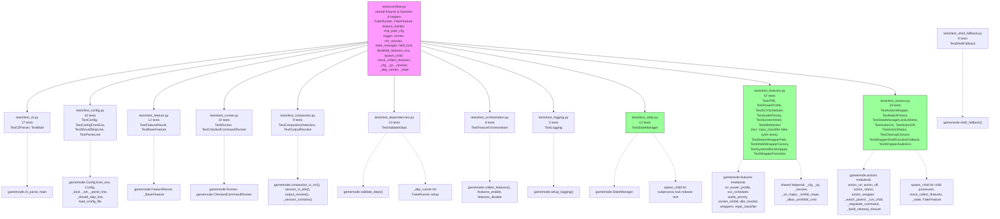
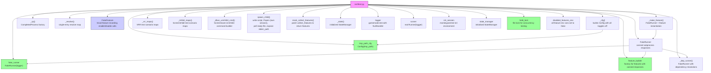
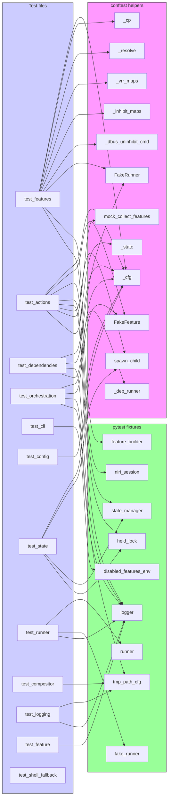
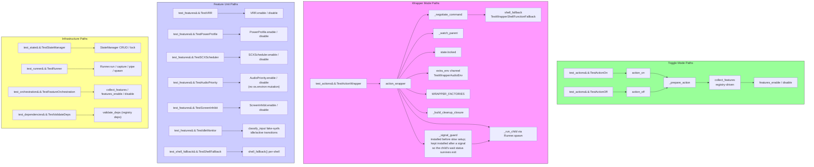

# Test Dependency Graph & Module Map

## CI Safety Rules

Rules for writing tests that pass on the GitHub Actions runner (`nix develop -c make ci-nix`,
`ubuntu-26.04`, `uv run pytest`). Every rule here was added because violating it produced a
failure that reproduced on CI but **not** locally — the class of bug that costs the most time,
because a green local run proves nothing.

1. **Never reconstruct a file path that another component wrote.** If a helper writes a
   diagnostics file, it must expose the path it used. A test that rebuilds the name from
   parameters silently reads the wrong file and prints an empty tail — which looks like "no
   output" and hides the traceback that explains the failure. This went unnoticed for two
   commits: every CI failure printed `stderr:` followed by nothing, so the real cause had to be
   guessed. `spawn_child` now attaches `stderr_path` to the `Popen`; consumers read that.

2. **Isolate every spawned child from the ambient process group.** In CI the chain is
   `Actions step → nix develop → make → uv run → pytest`, and children spawned without
   `start_new_session=True` share its process group. Any signal the environment directs at that
   group lands on the test subject and is indistinguishable from a product bug.
   `spawn_child` sets `start_new_session=True`; do not remove it.

3. **Pin the _whole_ config of a spawned child, never inherit defaults.** A child that builds a
   `Config` by hand must set every flag that could change what actually gets executed, not just
   the ones the author was thinking about. `action_wrapper` wraps its command with everything in
   `WRAPPER_FEATURES` (default `systemd_run,steam,inhibit`), so a child that left
   `enable_systemd_run`/`enable_sleep_inhibit` at their defaults really executed
   `systemd-run → systemd-inhibit → /bin/sleep 60`. That works on a developer box and dies in
   milliseconds on a host with a systemd session, so the test subject died before it could be
   signalled and every signal assertion reported a bogus `1` / `-15` / `-2`. This was the actual
   cause of the CI-only flake; `smoketest_wrapper_host_env.py` reproduces it on any machine.
   The same rule applies to environment: a spawned child inherits whatever `PATH` the runner had.

4. **A readiness marker must be written _after_ the state the test depends on.** A child that
   announces "ready" before installing its signal handlers (or before acquiring the lock the
   test probes) hands the test a race instead of a synchronization point.

5. **Reproducing the CI _value_ is not reproducing the CI _cause_.** A regression test that
   merely produces the same `returncode` (-15/-2) confirms the shape of the failure and nothing
   else — `test_signal_during_startup_is_not_lost` did exactly this, the fix it motivated was
   wrong, and CI stayed red. A regression test must fail **for the reason you believe is the
   cause**. If the log is not sufficient to identify the mechanism, fix the diagnostics (rule 1)
   and re-observe before writing any fix. Widen the window you actually suspect with a knob
   (e.g. `_spawn_signal_wrapper(slow_startup=True)`) rather than a different one.

6. **Never leave process-global state mutated — on any code path.** An earlier fix for this
   flake blocked `SIGTERM`/`SIGINT` in `_signal_guard`'s teardown. Because several tests call
   `action_wrapper` _in-process_, that permanently blocked those signals in the pytest process;
   every child spawned afterwards inherited the mask, could never be signalled, and all eight
   signal tests hung until timeout. Signal dispositions, signal masks, `cwd`, `umask` and
   `os.environ` are all global: restore them, or don't change them. (That fix was reverted once
   rule 3 turned out to be the real cause — it made the wrapper un-killable by Ctrl-C during
   shutdown, and the window it guarded was never the problem.)

7. **Run the whole suite, not a `-k` subset.** Rule 6's failure passed under `-k signal` and
   failed in the full run. A subset exercises a different set of preceding tests, so it cannot
   surface leaks between them.

8. **A CI-only failure demands local evidence before a fix ships.** Reproduce it on your own
   machine — the host coupling here was reproduced by putting failing `systemd-run`/
   `systemd-inhibit` stubs on `PATH` — or write a deterministic in-suite reproducer. Otherwise
   you are shipping a guess. The reproducer's docstring should name the exact CI values and
   messages it replaces.

9. **Every failure message needs rc _and_ the child's stderr.** Cheap, and it is often the only
   evidence that distinguishes "died to the signal" from "crashed before doing anything" — the
   whole systemd misdiagnosis was sitting in that stderr tail.

## Test Dependency Graph

```mermaid
graph TB
    conftest["tests/conftest.py<br/>central fixtures & factories & helpers<br/>FakeRunner, FakeFeature, feature_builder, tmp_path_cfg,<br/>logger, runner, niri_session, state_manager, held_lock,<br/>disabled_features_env, spawn_child, mock_collect_features,<br/>_cfg, _cp, _resolve, _dep_runner, _state"]

    test_cli["tests/test_cli.py<br/>17 tests<br/>TestCliParser, TestMain"]
    test_config["tests/test_config.py<br/>43 tests<br/>TestConfig, TestConfigFromEnv,<br/>TestShouldSkipLine, TestParseLine"]
    test_feature["tests/test_feature.py<br/>12 tests<br/>TestFeatureResult, TestBaseFeature"]
    test_runner["tests/test_runner.py<br/>10 tests<br/>TestRunner, TestCheckedCommandRunner"]
    test_compositor["tests/test_compositor.py<br/>9 tests<br/>TestCompositorDetection, TestOutputResolve"]
    test_deps["tests/test_dependencies.py<br/>13 tests<br/>TestValidateDeps"]
    test_orch["tests/test_orchestration.py<br/>6 tests<br/>TestFeatureOrchestration"]
    test_logging["tests/test_logging.py<br/>3 tests<br/>TestLogging"]
    test_state["tests/test_state.py<br/>12 tests<br/>TestStateManager"]
    test_features["tests/test_features.py<br/>67 tests<br/>TestVRR, TestPowerProfile, TestSCXScheduler,<br/>TestAudioPriority, TestScreenInhibit, TestIdleMonitor<br/>(incl. input_classifier fake-sysfs tests),<br/>TestSteamWrapperPath, TestInhibitWrapperFactory,<br/>TestSystemdRunWrapper, TestWrapperFactories"]
    test_actions["tests/test_actions.py<br/>26 tests<br/>TestActionWrapper, TestWatchParent,<br/>TestStateManagerLockLifetime,<br/>TestActionOn, TestActionOff,<br/>TestActionStatus, TestCleanupClosure,<br/>TestWrapperShellFunctionFallback, TestWrapperAudioEnv"]
    test_shell["tests/test_shell_fallback.py<br/>9 tests<br/>TestShellFallback"]

    conftest --> test_cli
    conftest --> test_config
    conftest --> test_feature
    conftest --> test_runner
    conftest --> test_compositor
    conftest --> test_deps
    conftest --> test_orch
    conftest --> test_logging
    conftest --> test_state
    conftest --> test_features
    conftest --> test_actions

    test_cli -.-> gamemode_cli["gamemode.cli_parse, main"]
    test_config -.-> gamemode_config["gamemode.Config.from_env, Config,<br/>_bool, _set, _parse_line, _should_skip_line,<br/>load_config_file"]
    test_feature -.-> gamemode_feature["gamemode.FeatureResult, _BaseFeature"]
    test_runner -.-> gamemode_runner["gamemode.Runner, gamemode.CheckedCommandRunner"]
    test_compositor -.-> gamemode_comp["gamemode.compositor_is_niri(), session_is_kde(),<br/>output_resolve(), _session_contains()"]
    test_deps -.-> gamemode_deps["gamemode.validate_deps()"]
    test_orch -.-> gamemode_orch["gamemode.collect_features(), features_enable,<br/>features_disable"]
    test_logging -.-> gamemode_log["gamemode.setup_logging()"]
    test_state -.-> gamemode_state["gamemode.StateManager"]
    test_features -.-> gamemode_features["gamemode.features modules&#58;<br/>vrr, power_profile, scx_scheduler,<br/>audio_priority, screen_inhibit, idle_monitor,<br/>wrappers, input_classifier"]
    test_actions -.-> gamemode_actions["gamemode.actions modules&#58;<br/>action_on, action_off, action_status,<br/>action_wrapper, _watch_parent, _run_child,<br/>_negotiate_command, _build_cleanup_closure"]
    test_shell -.-> gamemode_shell["gamemode.shell_fallback()"]

    test_features -.-> test_features_helper["shared helpers&#58; _cfg, _cp, _resolve,<br/>_vrr_maps, _inhibit_maps, _dbus_uninhibit_cmd"]
    test_deps -.-> test_deps_helper["_dep_runner for FakeRunner setup"]
    test_actions -.-> test_actions_helper["spawn_child for child processes,<br/>mock_collect_features, _state, FakeFeature"]
    test_state -.-> test_state_helper["spawn_child for subprocess lock release test"]

    style conftest fill:#f9f,stroke:#333
    style test_features fill:#9f9,stroke:#333
    style test_actions fill:#9f9,stroke:#333
    style test_state fill:#9f9,stroke:#333
```

## Test Module Map

### Test Configuration & Shared Infrastructure

| File          | Purpose                                                                | Key Fixtures & Classes                                                                                                                                                                                                                                                                                                                                                                                                                                                                                   |
| ------------- | ---------------------------------------------------------------------- | -------------------------------------------------------------------------------------------------------------------------------------------------------------------------------------------------------------------------------------------------------------------------------------------------------------------------------------------------------------------------------------------------------------------------------------------------------------------------------------------------------- |
| `conftest.py` | Central fixture definitions, FakeRunner, FakeFeature, helper factories | `tmp_path_cfg`, `logger`, `runner`, `fake_runner`, `feature_builder`, `niri_session`, `state_manager`, `held_lock`, `disabled_features_env`, `spawn_child`, `mock_collect_features`, `_cfg`, `_cp`, `_resolve`, `_dep_runner`, `_state`, `_make_feature`, `_vrr_maps`, `_inhibit_maps`, `_dbus_uninhibit_cmd`. `spawn_child` follows the CI Safety Rules: own session, generous ready deadline, stderr captured to a file whose path is exposed on the returned `Popen` (`stderr_path`), teardown reaps. |

### Unit Tests (by module)

| Test File                | Source Module       | Coverage                                                                                                                                                                                                                                              | Test Count |
| ------------------------ | ------------------- | ----------------------------------------------------------------------------------------------------------------------------------------------------------------------------------------------------------------------------------------------------- | ---------- |
| `test_cli.py`            | `cli.py`            | `cli_parse()` — all argument modes; `main()` version/usage/error                                                                                                                                                                                      | 17         |
| `test_config.py`         | `config.py`         | `Config` fields, bool/set parsing, `from_env()` single env boundary (file + env override, defaults, explicit mapping), `state_dir`, `systemd_run_args`, `toggle_features`, `wrapper_features`, `_parse_line`, `_should_skip_line`, `load_config_file` | 43         |
| `test_feature.py`        | `feature.py`        | `FeatureResult` factories (skip/did_change/error/noop), `_BaseFeature` gating, `log_feature_result`                                                                                                                                                   | 12         |
| `test_runner.py`         | `runner.py`         | `Runner.resolve()`, `require()`, `run()`, `pipe()`, `CheckedCommandRunner` (`run_or_none`, missing/error logging)                                                                                                                                     | 10         |
| `test_compositor.py`     | `compositor.py`     | niri/KDE detection (env + pgrep fallback), `_session_contains`, `output_resolve()`                                                                                                                                                                    | 9          |
| `test_dependencies.py`   | `dependencies.py`   | `validate_deps()` — registry-driven feature combinations, missing deps (incl. `niri`/`dms` gates), logging                                                                                                                                            | 13         |
| `test_orchestration.py`  | `orchestration.py`  | `collect_features()` — all/subset/empty via registry; `features_enable/disable`, logging                                                                                                                                                              | 6          |
| `test_logging.py`        | `logging_setup.py`  | console handler, file handler, debug mode file handler                                                                                                                                                                                                | 3          |
| `test_state.py`          | `state.py`          | `StateManager` CRUD, file locking, lock contention, process-death release, `pid_alive`, `cmd()`, `clear()` glob cleanup                                                                                                                               | 12         |
| `test_shell_fallback.py` | `shell_fallback.py` | `shell_fallback()` — bash (`BASH_ENV`→`~/.bashrc`), zsh, fish, `sh` unsupported, missing shell, pure env injection                                                                                                                                    | 9          |

### Smoke Tests

| File                            | Purpose                                                                                                                                                                                                                                                                                                                                                                                                                                           |
| ------------------------------- | ------------------------------------------------------------------------------------------------------------------------------------------------------------------------------------------------------------------------------------------------------------------------------------------------------------------------------------------------------------------------------------------------------------------------------------------------- |
| `smoketest_evdev_idle.py`       | Standalone script (not pytest) validating evdev KB&M device classification, `select()`-based polling, and idle/active transition detection on host system.                                                                                                                                                                                                                                                                                        |
| `smoketest_shell_function.py`   | Standalone script (not pytest) validating shell-function fallback end-to-end on the host: `fish -c`, `bash -c` + `BASH_ENV`, `zsh -c` + `.zshenv` resolve a shell function through a real `Popen`.                                                                                                                                                                                                                                                |
| `smoketest_wrapper_host_env.py` | Standalone script (not pytest) validating that `action_wrapper`'s `exec_cmd` is host-dependent. Scenario A makes the runner resolve a `systemd-inhibit` that fails and shows the command being replaced and dying in milliseconds (the CI-only signal-test flake, reproduced anywhere). Scenario B pins the wrapper features with the real systemd binaries still resolvable and shows `exec_cmd` verbatim and the command running to completion. |

### Integration Tests

| Test File          | Source Module         | Coverage                                                                                                                                                                                                                                                                                                                                                                                                                                                                                                                                                                                                                                                                                                                                                                                                                                                                | Test Count |
| ------------------ | --------------------- | ----------------------------------------------------------------------------------------------------------------------------------------------------------------------------------------------------------------------------------------------------------------------------------------------------------------------------------------------------------------------------------------------------------------------------------------------------------------------------------------------------------------------------------------------------------------------------------------------------------------------------------------------------------------------------------------------------------------------------------------------------------------------------------------------------------------------------------------------------------------------- | ---------- |
| `test_features.py` | `features/` (package) | All feature implementations: VRR, PowerProfile, SCXScheduler, AudioPriority (no `os.environ` mutation — env file is the contract), ScreenInhibit, idle monitor (incl. `input_classifier` fake-sysfs classification tests); wrapper factories: Steam, Inhibit, SystemdRun; WRAPPER_FACTORIES registry                                                                                                                                                                                                                                                                                                                                                                                                                                                                                                                                                                    | 67         |
| `test_actions.py`  | `actions.py`          | `action_wrapper()` normal exit/signal/concurrency/nonzero/OSError; signal handling pre-spawn (`test_signal_during_startup_is_not_lost`) and on the running child (`test_signal_exit_code_is_child_wait_status`, `test_cleanup_fires_on_signal`) — both spawned children pin the wrapper features so `exec_cmd` is exactly `/bin/sleep 60` on any host (see `smoketest_wrapper_host_env.py`); `_watch_parent` libc/prctl (including the warning it logs on prctl failure); lock lifetime (reuses the same wrapper child rather than a second probe script); `action_on` enable/idempotent/wrapper-active; `action_off` disable/clear; `action_status` output; `_build_cleanup_closure` idempotent/preserve_state; `TestWrapperShellFunctionFallback` (BASH_ENV Popen-scoped); `TestWrapperAudioEnv` (`PULSE_LATENCY_MSEC` via Popen env channel, `os.environ` untouched) | 26         |

### Test Coverage Summary

| Category    | Files  | Tests   | Scope                                       |
| ----------- | ------ | ------- | ------------------------------------------- |
| Unit        | 10     | 134     | Individual module functions/classes         |
| Integration | 2      | 93      | Cross-module: features, actions, subprocess |
| **Total**   | **12** | **227** | All public API paths                        |

### Feature Test Matrix

| Feature         | Toggle Test            | Wrapper Test | Key Scenarios                                                                                                                                                         |
| --------------- | ---------------------- | ------------ | --------------------------------------------------------------------------------------------------------------------------------------------------------------------- |
| VRR             | ✓ (`test_features.py`) |              | enable/disable/already_on/already_off/skip_not_capable/skip_no_niri                                                                                                   |
| PowerProfile    | ✓                      |              | enable/disable/already_game/noop/skip                                                                                                                                 |
| SCXScheduler    | ✓                      |              | enable/disable/switch_scheduler/noop/skip                                                                                                                             |
| AudioPriority   | ✓                      | ✓            | no `os.environ` mutation on enable/disable; env file write/remove; wrapper child receives `PULSE_LATENCY_MSEC` via Popen env (`test_actions.py::TestWrapperAudioEnv`) |
| ScreenInhibit   | ✓                      |              | DMS/ScreenSaver fallback/cookie/idempotent/error/all_fail                                                                                                             |
| IdleMonitor     | ✓                      |              | meaningful_activity filtering, `classify_input` fake-sysfs classification (kbm/steam controller/missing), timeout                                                     |
| Steam wrapper   |                        | ✓            | enabled/missing_script/disabled                                                                                                                                       |
| inhibit wrapper |                        | ✓            | disabled/systemd-inhibit missing/enabled                                                                                                                              |
| systemd-run     |                        | ✓            | disabled/missing/success/empty_args                                                                                                                                   |

## Fixture Dependency Chain

```mermaid
graph TD
    conftest["conftest.py"]

    conftest --> cfg["_cfg()<br/>builds Config with all toggles off"]
    conftest --> cp["_cp()<br/>CompletedProcess factory"]
    conftest --> resolve["_resolve()<br/>single-entry resolve map"]
    conftest --> fake_runner["FakeRunner<br/>canned subprocess responses"]
    conftest --> fake_feature["FakeFeature<br/>trivial feature recording enable/disable calls"]
    conftest --> make_feat["_make_feature()<br/>FakeRunner + feature instantiation"]
    conftest --> vrr_maps["_vrr_maps()<br/>VRR test scenario maps"]
    conftest --> inhibit_maps["_inhibit_maps()<br/>ScreenInhibit test scenario maps"]
    conftest --> dbus_uninhibit["_dbus_uninhibit_cmd()<br/>ScreenSaver.UnInhibit command builder"]
    conftest --> spawn_child["spawn_child()<br/>write script, Popen (own session),<br/>poll ready file, expose stderr_path"]
    conftest --> mock_collect["mock_collect_features()<br/>patch collect_features to return features"]
    conftest --> dep_runner["_dep_runner()<br/>FakeRunner with dependency resolutions"]
    conftest --> state_helper["_state()<br/>initialized StateManager"]

    conftest --> tmp_path_cfg["tmp_path_cfg<br/>Config(tmp_path)"]
    conftest --> logger["logger<br/>gamemode.test with NullHandler"]
    conftest --> runner_fixture["runner<br/>real Runner(logger)"]
    conftest --> fake_runner_fixture["fake_runner<br/>FakeRunner(logger)"]
    conftest --> feat_builder["feature_builder<br/>factory for features with canned responses"]
    conftest --> niri_sess["niri_session<br/>monkeypatched niri environment"]
    conftest --> state_mgr["state_manager<br/>initialised StateManager"]
    conftest --> held_lock["held_lock<br/>file lock for concurrency testing"]
    conftest --> disabled_env["disabled_features_env<br/>all feature env vars set to false"]

    cfg --> tmp_path_cfg
    fake_runner --> fake_runner_fixture
    fake_runner --> feat_builder
    fake_runner --> dep_runner
    make_feat --> fake_runner

    style conftest fill:#f9f,stroke:#333
    style tmp_path_cfg fill:#9f9,stroke:#333
    style fake_runner_fixture fill:#9f9,stroke:#333
    style feat_builder fill:#9f9,stroke:#333
    style held_lock fill:#9f9,stroke:#333
    style fake_feature fill:#ccf,stroke:#333
```

## Test Helper Consumption

Shows which test files consume which conftest helpers (direct imports from `tests.conftest`).

```mermaid
graph LR
    subgraph helpers["conftest helpers"]
        cfg["_cfg"]
        cp["_cp"]
        resolve["_resolve"]
        vrr_maps["_vrr_maps"]
        inhibit_maps["_inhibit_maps"]
        dbus_uninhibit["_dbus_uninhibit_cmd"]
        fake_runner["FakeRunner"]
        fake_feature["FakeFeature"]
        spawn_child["spawn_child"]
        mock_collect["mock_collect_features"]
        dep_runner["_dep_runner"]
        state_helper["_state"]
    end

    subgraph fixtures["pytest fixtures"]
        tmp_path_cfg["tmp_path_cfg"]
        logger["logger"]
        runner["runner"]
        fake_runner_f["fake_runner"]
        feat_builder["feature_builder"]
        niri_sess["niri_session"]
        state_mgr["state_manager"]
        held_lock["held_lock"]
        disabled_env["disabled_features_env"]
    end

    subgraph consumers["Test files"]
        test_features["test_features"]
        test_actions["test_actions"]
        test_deps["test_dependencies"]
        test_orch["test_orchestration"]
        test_cli["test_cli"]
        test_config["test_config"]
        test_state["test_state"]
        test_runner["test_runner"]
        test_compositor["test_compositor"]
        test_logging["test_logging"]
        test_feature["test_feature"]
        test_shell["test_shell_fallback"]
    end

    test_features --> cfg
    test_features --> cp
    test_features --> resolve
    test_features --> vrr_maps
    test_features --> inhibit_maps
    test_features --> dbus_uninhibit
    test_features --> fake_runner
    test_features --> feat_builder
    test_features --> niri_sess

    test_actions --> cfg
    test_actions --> fake_feature
    test_actions --> state_mgr
    test_actions --> held_lock
    test_actions --> logger
    test_actions --> spawn_child
    test_actions --> mock_collect
    test_actions --> state_helper

    test_deps --> cfg
    test_deps --> fake_runner
    test_deps --> logger
    test_deps --> dep_runner

    test_orch --> cfg
    test_orch --> fake_feature
    test_orch --> tmp_path_cfg
    test_orch --> logger

    test_state --> cfg
    test_state --> spawn_child
    test_state --> state_mgr
    test_state --> held_lock

    test_cli --> disabled_env

    test_config --> cfg

    test_runner --> runner
    test_runner --> fake_runner_f
    test_runner --> logger

    test_compositor --> tmp_path_cfg

    test_logging --> tmp_path_cfg
    test_logging --> logger

    test_feature --> logger

    style helpers fill:#f9f,stroke:#333
    style fixtures fill:#9f9,stroke:#333
    style consumers fill:#ccf,stroke:#333
```

`test_shell_fallback.py` imports no conftest helpers — it is pure (`shell_fallback` takes an explicit `env` mapping) and uses only `monkeypatch`.

## Test Execution Flow

Shows how tests exercise the runtime paths — which test classes cover which execution paths.

```mermaid
graph TD
    subgraph toggle["Toggle Mode Paths"]
        A["test_actions&#58;&#58;TestActionOn"] --> B[action_on]
        C["test_actions&#58;&#58;TestActionOff"] --> D[action_off]
        B --> E[_prepare_action]
        D --> E
        E --> F[collect_features<br/>registry-driven]
        F --> G[features_enable / disable]
    end

    subgraph wrapper["Wrapper Mode Paths"]
        H["test_actions&#58;&#58;TestActionWrapper"] --> I[action_wrapper]
        I --> J[_negotiate_command]
        J --> J2["shell_fallback<br/>TestWrapperShellFunctionFallback"]
        I --> K[_watch_parent]
        I --> L["state.locked"]
        I --> M["extra_env channel<br/>TestWrapperAudioEnv"]
        I --> N[WRAPPER_FACTORIES]
        I --> O[_run_child via Runner.spawn]
        I --> P[_build_cleanup_closure]
        I --> P2["_signal_guard<br/>installed before slow setup;<br/>kept installed after a signal<br/>so the child's wait status survives exit"]
        P2 --> O
    end

    subgraph feature_tests["Feature Unit Paths"]
        Q["test_features&#58;&#58;TestVRR"] --> R["VRR.enable / disable"]
        S["test_features&#58;&#58;TestPowerProfile"] --> T["PowerProfile.enable / disable"]
        U["test_features&#58;&#58;TestSCXScheduler"] --> V["SCXScheduler.enable / disable"]
        W["test_features&#58;&#58;TestAudioPriority"] --> X["AudioPriority.enable / disable<br/>(no os.environ mutation)"]
        Y["test_features&#58;&#58;TestScreenInhibit"] --> Z["ScreenInhibit.enable / disable"]
        Y2["test_features&#58;&#58;TestIdleMonitor"] --> Z2["classify_input fake-sysfs<br/>idle/active transitions"]
        Y3["test_shell_fallback&#58;&#58;TestShellFallback"] --> Z3["shell_fallback() per-shell"]
    end

    subgraph infra["Infrastructure Paths"]
        AA["test_state&#58;&#58;TestStateManager"] --> AB[StateManager CRUD / lock]
        AC["test_runner&#58;&#58;TestRunner"] --> AD["Runner.run / capture / pipe / spawn"]
        AE["test_orchestration&#58;&#58;TestFeatureOrchestration"] --> AF[collect_features / features_enable / disable]
        AG["test_dependencies&#58;&#58;TestValidateDeps"] --> AH["validate_deps (registry deps)"]
    end

    style toggle fill:#9f9,stroke:#333
    style wrapper fill:#f9f,stroke:#333
    style feature_tests fill:#ccf,stroke:#333
    style infra fill:#ff9,stroke:#333
```
